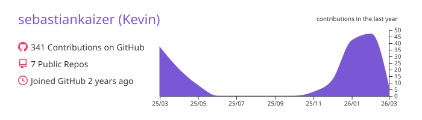
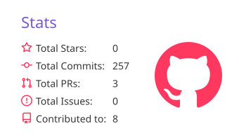
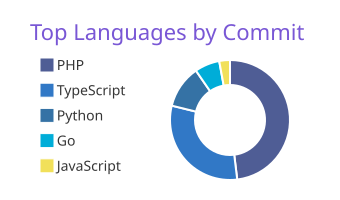
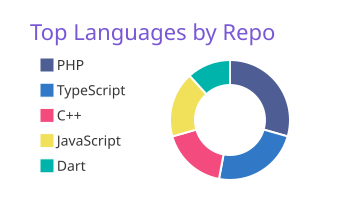

## Software Developer  
**Backend (Intermediate) · Frontend (Entry-Level)**

Informatics fresh graduate with hands-on experience building backend systems and modern frontend interfaces.  
Backend-focused, with growing frontend expertise and a strong sense of UI design.

_"Disinilah aku berkreasi dan tidak akan menyerah"_

---

## 🔎 Open to Opportunities

**Backend Engineer (Intermediate)** **Frontend Engineer (Entry-Level)** 

<strong>Positioning Note</strong>

I am not positioning myself as a Fullstack Engineer.  
I prefer working with clear role boundaries while collaborating closely across teams.

On-site · Hybrid · Remote

---

## 📊 GitHub Activity & Statistics

 

  
  &nbsp;
  
  &nbsp;
  

---

## 🧠 Technical Focus

### Backend Development

### Frontend Development

### Databases & Tools

---

## 🏆 Selected Projects

<table align="center">
  <tr>
    <th>Project</th>
    <th>Focus</th>
    <th>Tech Stack</th>
  </tr>
  <tr>
    <td><a href="https://github.com/sebastiankaizer/log-engine">Log Engine</a></td>
    <td>Distributed ingestion</td>
    <td>Go, gRPC</td>
  </tr>
  <tr>
    <td><a href="https://github.com/sebastiankaizer/Atomic-Ticket-Engine">Atomic Ticket Engine</a></td>
    <td>Concurrent transactions</td>
    <td>TypeScript, PostgreSQL</td>
  </tr>
  <tr>
    <td><a href="https://github.com/sebastiankaizer/Redis-Leaderboard-Service">Redis Leaderboard</a></td>
    <td>Real-time ranking</td>
    <td>TypeScript, Redis</td>
  </tr>
  <tr>
    <td>Atma Kitchen</td>
    <td>Workflow system</td>
    <td>Laravel, Flutter</td>
  </tr>
  <tr>
    <td>Imperial Hotel</td>
    <td>Reservation system</td>
    <td>PHP, Laravel</td>
  </tr>
  <tr>
    <td>Sat Brimob App</td>
    <td>Mobile operations UI</td>
    <td>Flutter</td>
  </tr>
  <tr>
    <td>Tokopedia Analysis</td>
    <td>Data visualization</td>
    <td>Python</td>
  </tr>
</table>

---

